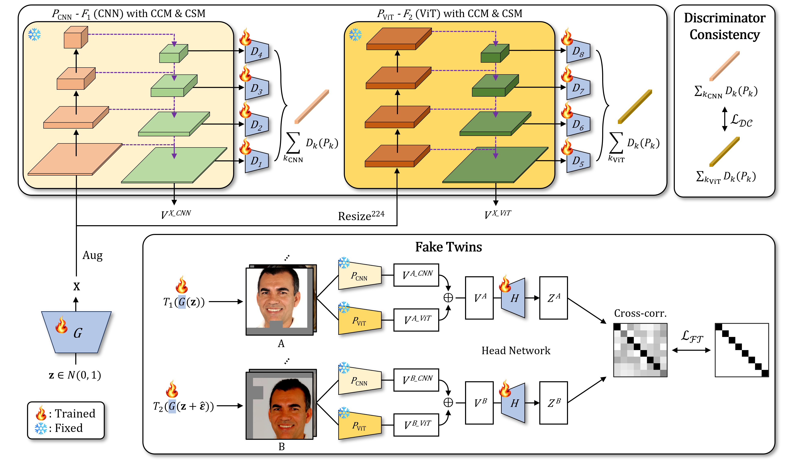

## HP-GAN &mdash; Official PyTorch implementation


[[Paper](https://www.sciencedirect.com/science/article/pii/S0893608026001280?dgcid=rss_sd_all)]
[[Arxiv](https://arxiv.org/abs/2602.03039)]

This repository contains code for our *Neural Networks* paper "HP-GAN: Harnessing Pretrained Networks for GAN Improvement with FakeTwins and Discriminator Consistency"

by [Geonhui Son](https://scholar.google.co.kr/citations?user=oHpLEykAAAAJ&hl=ko&oi=ao), [Jeong Ryong Lee](https://scholar.google.co.kr/citations?user=brQgjXcAAAAJ&hl=ko&oi=ao) and [Dosik Hwang](https://scholar.google.co.kr/citations?user=PciqeBcAAAAJ&hl=ko&oi=ao). <br>

<!-- ## ToDos
- [x] Initial code release
- [ ] Providing pretrained models -->

## Requirements ##
- 64-bit Python 3.8 and PyTorch 1.9.0 (or later). See https://pytorch.org for PyTorch install instructions.
- CUDA toolkit 11.1 or later.
- GCC 7 or later compilers. The recommended GCC version depends on your CUDA version; see for example, CUDA 11.4 system requirements.
- Use the following commands with Miniconda3 to create and activate your PG Python environment:
    - ```conda env create -f environment.yml```
    - ```conda activate hp-gan```

## Data Preparation ##
For a quick start, you can download the few-shot datasets provided by the authors of [FastGAN](https://github.com/odegeasslbc/FastGAN-pytorch). You can download them [here](https://drive.google.com/file/d/1aAJCZbXNHyraJ6Mi13dSbe7pTyfPXha0/view). To prepare the dataset at the respective resolution, run for example
```
python dataset_tool.py --source=./data/pokemon --dest=./data/pokemon256.zip \
  --resolution=256x256 --transform=center-crop
```
You can get the datasets we used in our paper at their respective websites:
[CLEVR](https://cs.stanford.edu/people/jcjohns/clevr/), [FFHQ](https://github.com/NVlabs/ffhq-dataset), [Cityscapes](https://www.cityscapes-dataset.com/), [LSUN](https://github.com/fyu/lsun), [AFHQ](https://github.com/clovaai/stargan-v2), [Landscape](https://www.kaggle.com/arnaud58/landscape-pictures).

## Training ##


Training your own HP-GAN on Pokemnon dataset using 8 GPUs:
```
python train.py --outdir=./training-runs/ --cfg=fastgan_lite --data=./data/pokemon256.zip \
  --gpus=8 --batch=64 --mirror=1 --snap=50 --batch-gpu=8 --kimg=10000 --dc=True --ft=True
```
```--batch``` specifies the overall batch size, ```--batch-gpu``` specifies the batch size per GPU. The training loop will automatically accumulate gradients if you use fewer GPUs until the overall batch size is reached.

```--dc``` enables **Discriminator Consistency** and ```--ft``` enables **FakeTwins**. We train with a lightweight version of FastGAN by default (```--cfg=fastgan_lite```).

Samples and metrics are saved in ```outdir```. To monitor the training progress, you can inspect ```fid50k_full.json``` or run tensorboard in ```training-runs/```.

## Generating Samples & Interpolations ##

To generate samples and interpolation videos, run
```
python gen_images.py --outdir=out --trunc=1.0 --seeds=10-15 \
  --network=PATH_TO_NETWORK_PKL
```
and
```
python gen_video.py --output=lerp.mp4 --trunc=1.0 --seeds=0-31 --grid=4x2 \
  --network=PATH_TO_NETWORK_PKL
```

## Quality Metrics ##
Per default, ```train.py``` tracks FID50k during training. To calculate metrics for a specific network snapshot, run

```
python calc_metrics.py --metrics=fid50k_full --network=PATH_TO_NETWORK_PKL
```

To see the available metrics, run
```
python calc_metrics.py --help
```

## Pretrained Models ##
We provide the following pretrained models (as `PATH_TO_NETWORK_PKL`):

|Dataset| Res | FID | PATH
 :---  |  :---:  |  :---:  | :---:
FFHQ| 256<sup>2</sup>  |1.69|  [link](https://drive.google.com/file/d/1y_LpH_880wmvMNuo-iFUBrvEdKx9BOJc/view?usp=sharing)<br>
Pokemon| 256<sup>2</sup>  |23.62|  [link](https://drive.google.com/file/d/1mVg-oVKkiM1joMnQefH6e_MVoMKhCNF7/view?usp=sharing)<br>
LSUN-Bedroom| 256<sup>2</sup>  |1.19|  [link](https://drive.google.com/file/d/1L-da4sRvdWkV57oMTKx3DwUN66dC4By3/view?usp=sharing)<br>
LSUN-Church| 256<sup>2</sup>  |1.44|  [link](https://drive.google.com/file/d/1ud44FwtQtTM9Qv3SnN5yhY30Nx86ZyGf/view?usp=sharing)<br>
AFHQ-Cat| 512<sup>2</sup>  |1.81|  [link](https://drive.google.com/file/d/1rdQrugP_fNm_qgKEklifilcnoS__oIJf/view?usp=sharing)<br>
AFHQ-Dog| 512<sup>2</sup>  |3.63|  [link](https://drive.google.com/file/d/1TzTQzoZpMCqwfHNicg5_TkrGAXgxlY8j/view?usp=sharing)<br>
AFHQ-Wild| 512<sup>2</sup>  |1.18|  [link](https://drive.google.com/file/d/1G0B496anztOhc-SA2pwYSWdqL5uPnwVf/view?usp=sharing)<br>


## Citation
```
@article{son2026hp,
  title={HP-GAN: Harnessing Pretrained Networks for GAN Improvement with FakeTwins and Discriminator Consistency},
  author={Son, Geonhui and Lee, Jeongryong and Hwang, Doisk},
  journal={Neural Networks},
  pages={108666},
  year={2026},
  publisher={Elsevier}
}
```

## Acknowledgemnets
Our code builds upon the awesome [styleGAN2-ADA](https://github.com/NVlabs/stylegan2-ada-pytorch), [StyleGAN3](https://github.com/NVlabs/stylegan3), [ProjectedGAN](https://github.com/autonomousvision/projected-gan) and [StyleGAN-XL](https://github.com/autonomousvision/stylegan-xl/).

Furthermore, we use parts of the code of [FastGAN](https://github.com/odegeasslbc/FastGAN-pytorch), [MiDas](https://github.com/isl-org/MiDaS), [InsGen](https://github.com/genforce/insgen), [FakeCLR](https://github.com/iceli1007/FakeCLR/) and [Barlow Twins](https://github.com/facebookresearch/barlowtwins).
